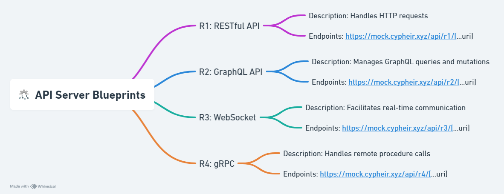
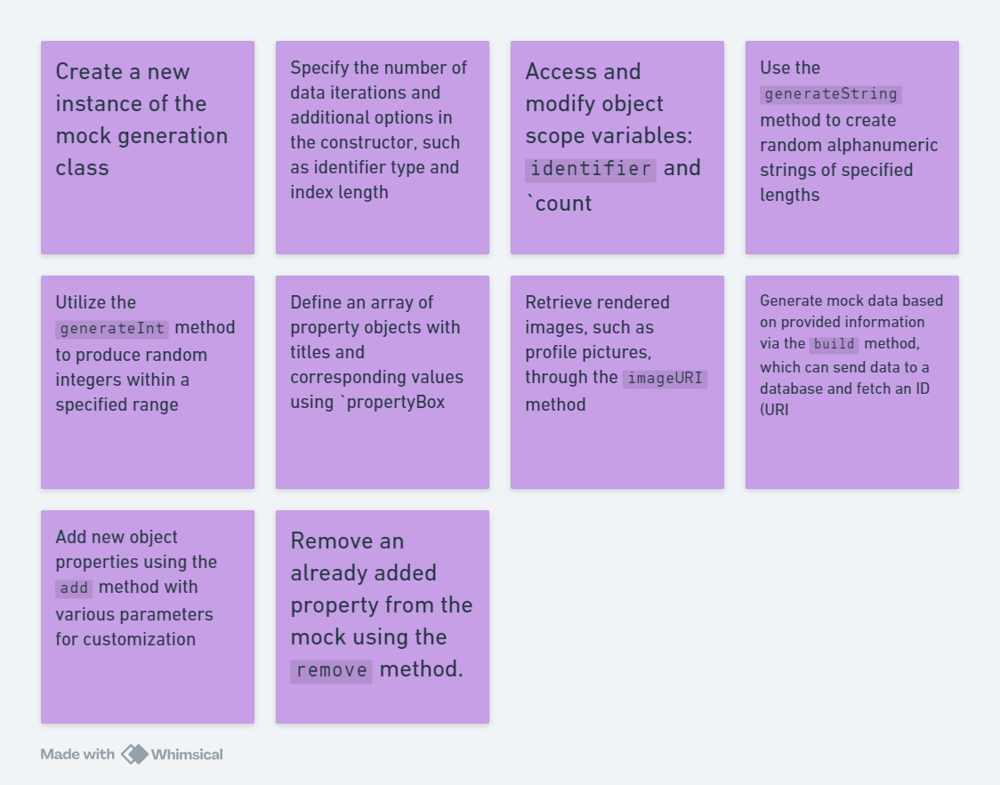
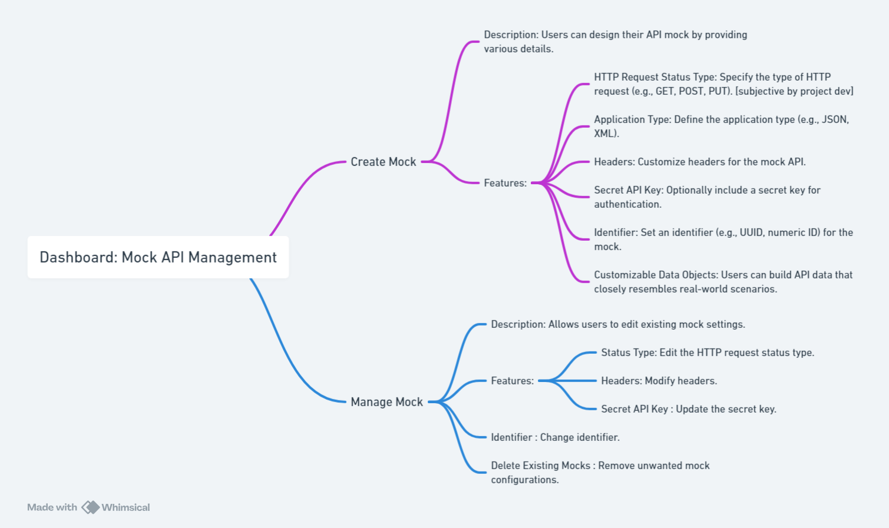
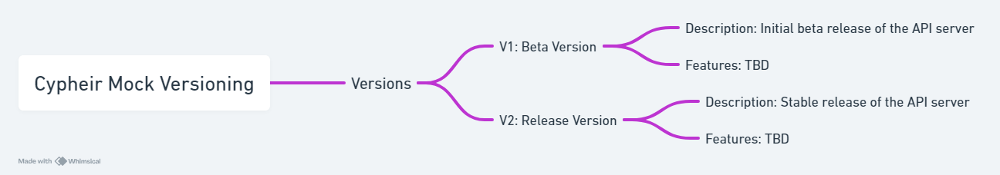

# Mock CYPHEIR: Mock API Generator

Mock CYPHEIR is an object-oriented mock API generator that allows you to create various mock data samples. Whether you're testing, prototyping, or simulating data, this tool provides flexibility and customization.

| Data Fetching Flow                                         | Basic User Flow                                     |
| ---------------------------------------------------------- | --------------------------------------------------- |
|  |  |

 

## Class: GenerateMock

Create a new mock generation class object.

### Constructor

-   `count`: Number of data iterations.
-   `opts`: Additional options.
    -   `id`: Identifier type ("digits" or "random"). Default: "digits" (e.g., 1 or "erB2l").
    -   `indexLength`: Length of the string when id is random. Default: 6.

### Object Scope Variables

-   `identifier`: String or number. If id is "digits," it's 0; otherwise, it's generated using `generateString(indexLength)`.
-   `count`: Number of iterations.

### Methods

1. `generateString(length: number): string`

    - Generates a random alphanumeric string of the specified length.
    - Example: `generateString(8)` might return "aB3x9Y7z."

2. `generateInt(min: number, max: number): number`

    - Generates a random integer between `min` (inclusive) and `max` (exclusive).

3. `propertyBox: { title: string, property: string | number | () => string | number }[]`

    - An array of property objects with titles and corresponding values.

4. `imageURI(type: string): callback`

    - Retrieves the type of rendered images (e.g., profile pictures).

5. `build(): Promise<Array<DataSchema>> | string`

    - Generates mock data based on provided information.
    - Sends data to a database and fetches the ID (URI).

6. `add(): object`

    - Creates a new object property.
    - Parameters:
        - `title`: Property name/title.
        - `attribute`: Static property attribute (string, number, array, or object).
        - `opts`: Options to override default attribute properties.
        - `type`: Attribute type (e.g., "name," "email," "custom").
        - `setAttribute`: Callback function returning custom attribute properties.

7. `remove(name: string): string`
    - Removes an already added property from the mock.
    - Parameter: `name` (name of the mock property).

 

## Dashboard: Mock API Management

### Create Mock

-   **Description**: Users can design their API mock by providing various details.
-   **Features**:
    -   **HTTP Request Status Type**: Specify the type of HTTP request (e.g., GET, POST, PUT). _[Subjective by project dev]_
    -   **Application Type**: Define the application type (e.g., JSON, XML).
    -   **Headers**: Customize headers for the mock API.
    -   **Secret API Key**: Optionally include a secret key for authentication.
    -   **Identifier**: Set an identifier (e.g., UUID, numeric ID) for the mock.
    -   **Customizable Data Objects**: Users can build API data that closely resembles real-world scenarios.

### Manage Mock

-   **Description**: Allows users to edit existing mock settings.
-   **Features**:
    -   **Status Type**: Edit the HTTP request status type.
    -   **Headers**: Modify headers.
    -   **Secret API Key**: Update the secret key.
    -   **Identifier**: Change the identifier.
    -   **Delete Existing Mocks**: Remove unwanted mock configurations.

 

## API Server Blueprints

### Routers

#### R1: RESTful API

-   **Description**: RESTful API router for handling HTTP requests
-   **Endpoints**: `https://mock.cypheir.xyz/api/r1/[...uri]`

#### R2: GraphQL API

-   **Description**: GraphQL API router for handling GraphQL queries and mutations
-   **Endpoints**: `https://mock.cypheir.xyz/api/r2/[...uri]`

#### R3: WebSocket

-   **Description**: WebSocket router for handling real-time communication
-   **Endpoints**: `https://mock.cypheir.xyz/api/r3/[...uri]`

#### R4: gRPC

-   **Description**: gRPC router for handling remote procedure calls
-   **Endpoints**: `https://mock.cypheir.xyz/api/r4/[...uri]`

 

## Versions

### V1: Beta Version

-   **Description**: Initial beta release of the API server
-   **Features**: TBD

### V2: Release Version

-   **Description**: Stable release of the API server
-   **Features**: TBD

## Credit

Be shout out to <a href="https://whimsical.com/" style="font-weight: 600;">Whimsical</a> for the AI powered flowchart and mind map generator!
